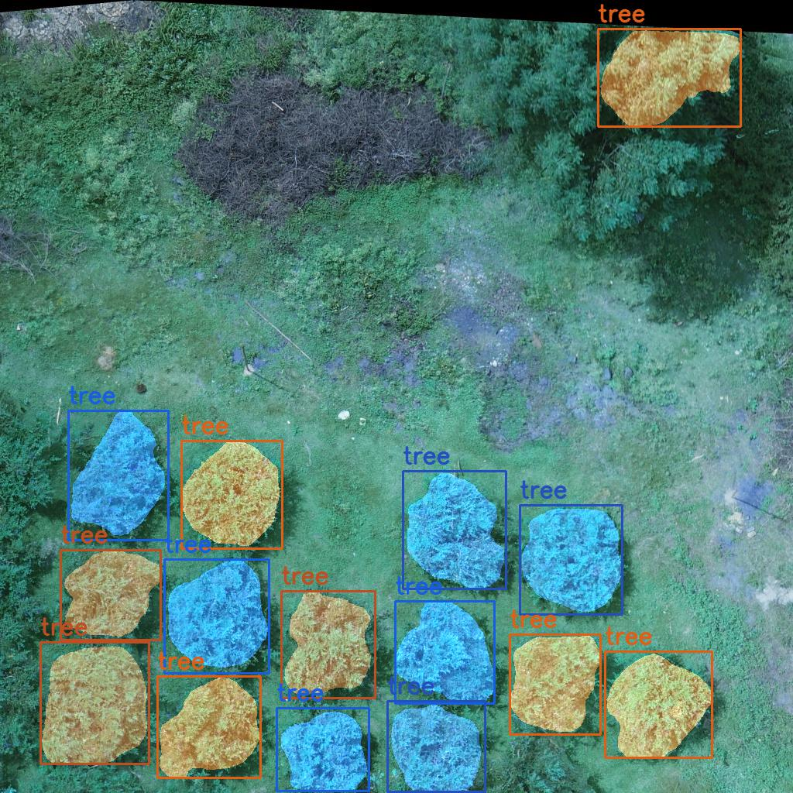
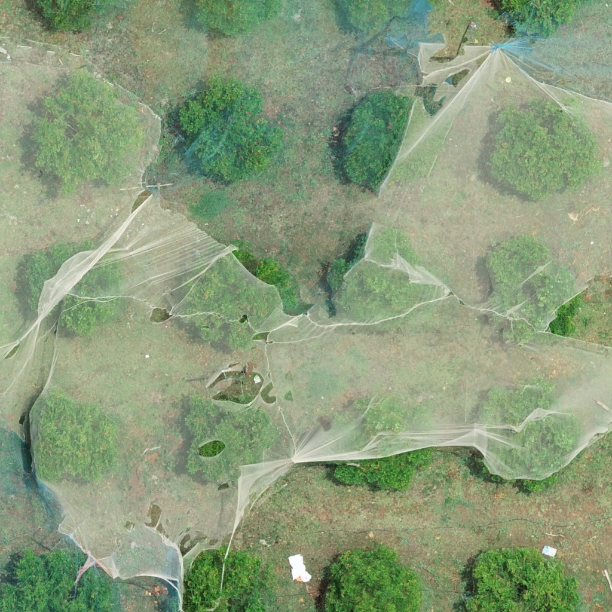
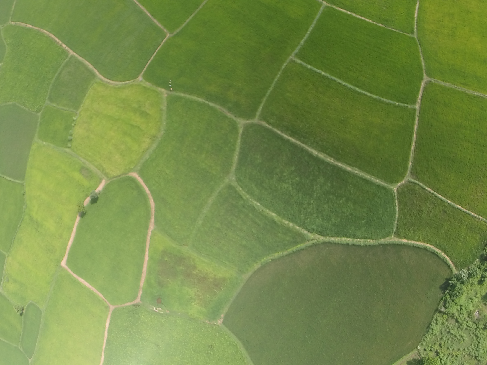

# Mask-RCNN Agricultural Classifier for Paddy Fields and Pomegranate Trees

This project implements an advanced computer vision system using **Mask-RCNN** to accurately classify and segment paddy fields and pomegranate trees in agricultural imagery. The system features a sophisticated PyQt5-based graphical user interface for intuitive interaction and visualization of segmentation results.



## Technical Overview

The application leverages a custom-trained Mask-RCNN model to perform instance segmentation on agricultural imagery. The model identifies and segments two primary classes:

- **Pomegranate Trees**: Detected and labeled with bounding boxes and pixel-level segmentation masks
  
  

- **Paddy Fields**: Accurately segmented with distinct color overlays



### Core Technologies

- **Mask-RCNN Architecture**: Implemented using PyTorch for deep learning-based instance segmentation
- **PyQt5 Framework**: Provides a responsive and interactive user interface
- **OpenCV**: Used for image processing and visualization of segmentation masks
- **Torch Vision**: Provides transformations and utilities for working with image data

## System Architecture

### Model Components

- Pre-trained Mask-RCNN model fine-tuned on agricultural imagery
- Custom weights stored in `mask_rcnn_tree_pady.pt`
- COCO-style class definitions for agricultural objects

### Processing Pipeline

1. **Image Acquisition**: Load images from the specified directory
2. **Pre-processing**: Convert images to tensor format and normalize
3. **Inference**: Pass processed images through the Mask-RCNN model
4. **Post-processing**: Apply confidence thresholding (default: 0.65) to filter predictions
5. **Visualization**: Render segmentation masks and bounding boxes on the original image
6. **Result Storage**: Save processed images with annotations to the output directory

## Installation

### Prerequisites

- Python 3.6+
- PyTorch 1.7+
- CUDA-capable GPU (recommended for faster inference)

### Setup

1. Clone the repository:

   ```bash
   git clone https://github.com/your-username/MaskRCNN-AgriClassifier.git
   cd MaskRCNN-AgriClassifier
   ```

2. Install the required dependencies:

   ```bash
   pip install -r requirements.txt
   ```

3. Download the pre-trained model weights (if not included in the repository):
   - Place `mask_rcnn_tree_pady.pt` in the project root directory

4. Run the application:

   ```bash
   python main.py
   ```

## Usage Guide

### User Interface

The application provides an intuitive interface with the following features:

- **Image Loading**: Select input images or directories for processing
- **Visualization Controls**: Zoom, pan, and navigate through processed images
- **Batch Processing**: Process multiple images sequentially with progress tracking
- **Result Inspection**: View segmentation masks, bounding boxes, and class labels

### Processing Workflow

1. Launch the application using `python main.py`
2. Use the interface to select input images from the `images` directory
3. Initiate processing by clicking the appropriate button
4. View results with segmentation masks overlaid on the original images
5. Processed images are automatically saved to the `processed_images` directory

## Technical Implementation Details

### Segmentation Algorithm

The core segmentation functionality is implemented in the `tree_Segmentation` method, which:

1. Loads the Mask-RCNN model from the specified weights file
2. Transforms input images to the required tensor format
3. Performs inference to generate masks, bounding boxes, and class predictions
4. Applies a confidence threshold to filter predictions
5. Renders the segmentation results with color-coded masks and labels

### Model Configuration

- **Confidence Threshold**: 0.65 (configurable)
- **Classes**: Background, Tree (Pomegranate), Paddy
- **Device**: Automatically selects GPU if available, falls back to CPU

## Future Development

1. **Model Improvements**:
   - Expand the model to classify additional crop types and agricultural features
   - Implement transfer learning for adaptation to new agricultural environments

2. **Interface Enhancements**:
   - Add statistical analysis of detected objects
   - Implement real-time video processing capabilities
   - Integrate with GIS systems for geospatial analysis

3. **Performance Optimization**:
   - Implement model quantization for faster inference
   - Add batch processing optimizations for large datasets

## Contributing

Contributions to improve the classifier are welcome. Please feel free to submit pull requests or open issues to discuss potential enhancements.

## License

This project is licensed under the terms of the included LICENSE file.

